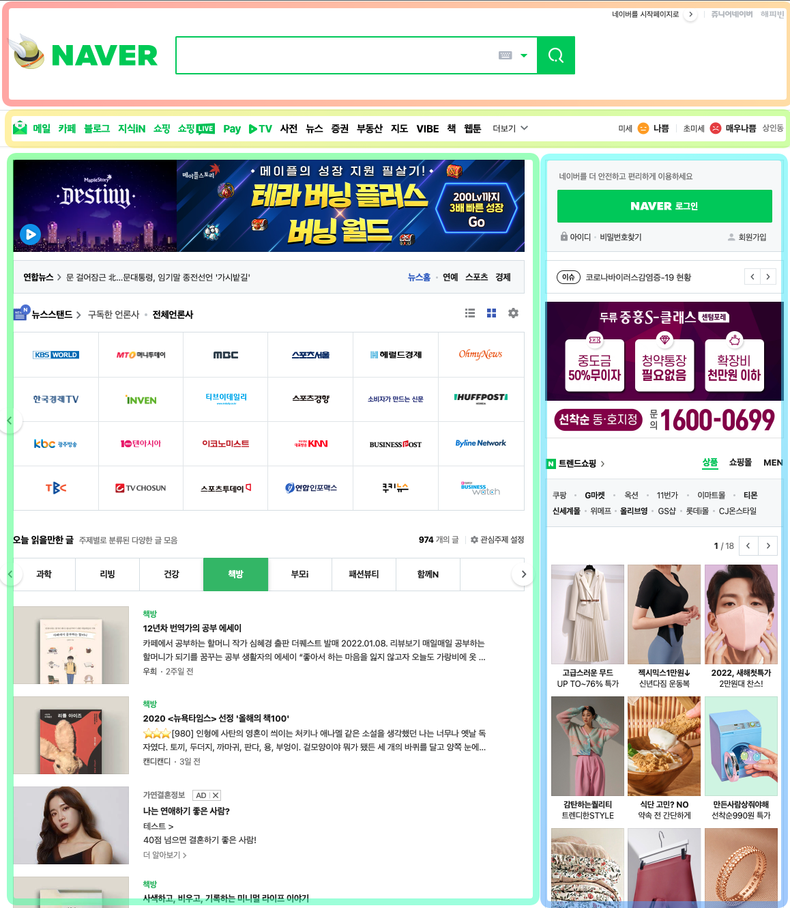

# NAVER Page Clone coding
220109 - Naver 홈페이지 클론코딩 시작.
 

# 🛠 Header 작업 내역 🛠 
- [x] HTML
- [ ] CSS (sub-menu부분 css 추가 작업필요[hover-decoration && colorFunc])

## 22.01.09(일) - 시작
### 01. 큰 섹션 나누기
 
세션을 크게 5가지로 나누었다.
- header
- nav
- section(article)
- aside
- footer

 

### 02.작업 현황
 
header 틀을 간단하게 제작해보았다.
 